## Nmap

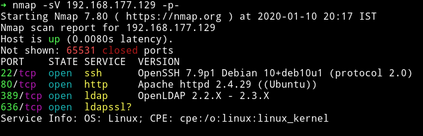

We see that there is LDAP service and usual HTTP & SSH service. Let's start our enumeration with HTTP service.

***

## HTTP


I ran gobuster on that and found some pages:

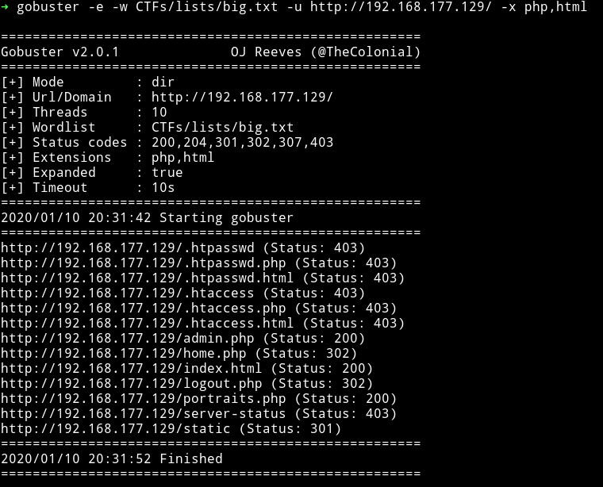

When we visit `/home.php` we are redirected to `/admin.php` so I used `httpie` to visit the page and there we can notice that there is some `/home.php?url` kind of redirection done.

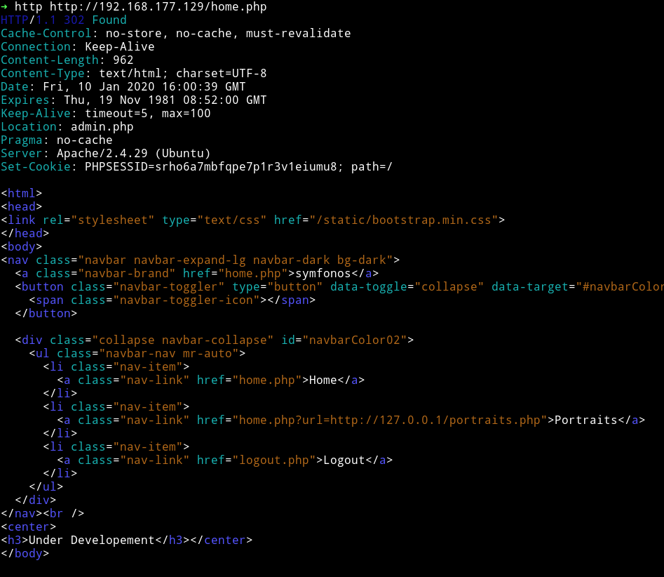

So [theart42](http://twitter.com/theart42) said that we can try to read files via that redirect, so we did

```bash
➜ http http://192.168.177.129/home.php\?url\=file:///etc/passwd
```

And we'd get the content of `/etc/passwd` file.

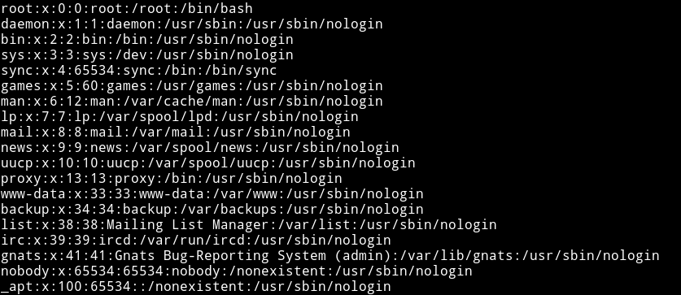

Since we can read files we decided to read `admin.php` and in that we found the password for admin. The path for the file would be `/var/www/html/admin.php`
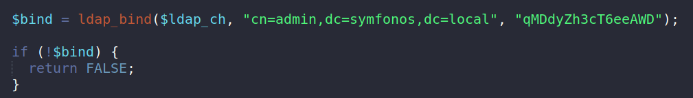

***

## LDAP

The password we got from `admin.php` for accessing LDAP service. If you are not using Kali linux then you can download [`ldapadmin`](https://github.com/ibv/LDAP-Admin/releases), this is a GUI tool to access LDAP services. I tried using jxplorer but that didn't worked for me.

You can add a new connection in LDAP-admin in the following way:

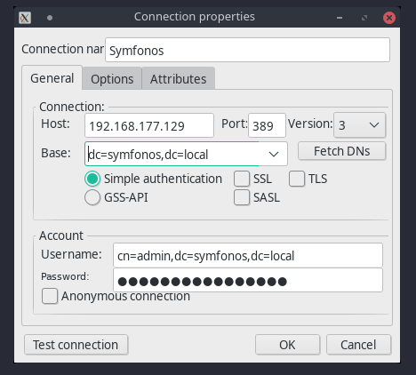

And then once we connect we can see that there is a `uid=zeus` which contains the password for `zeus`.

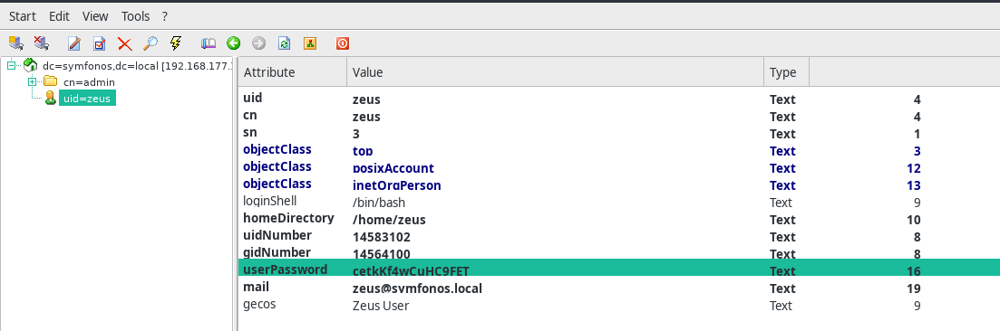

`zeus:cetkKf4wCuHC9FET`

I used these credentials to connect to SSH service.

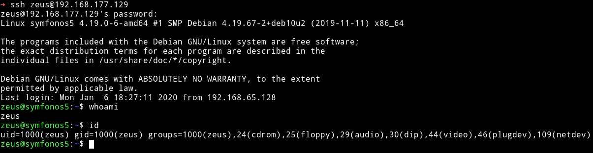

***

## Privilege Escalation

The first thing that I checked was the `sudo rights`

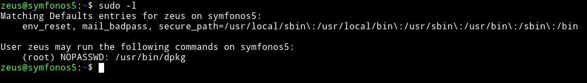

We are allowed to run `dpkg` as root user. I used [gtfo](github.com/mzfr/gtfo) to search gtfobin for `dpkg` and it actually had a way to exploit those sudo rights.

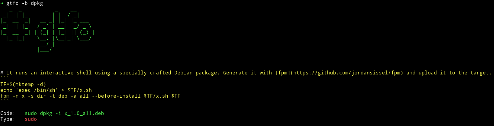

I ran the following commands on my own system:

```bash
➜ echo 'exec /bin/sh' > x.sh
➜ fpm -n x -s dir -t deb -a all --before-install x.sh .
➜ mv x_1.0_all.deb hack.deb
```

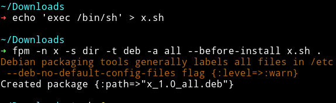

Then I tranfered the `.deb` file to the machine and got the root shell by running:

```bash
sudo dpkg -i hack.deb
```

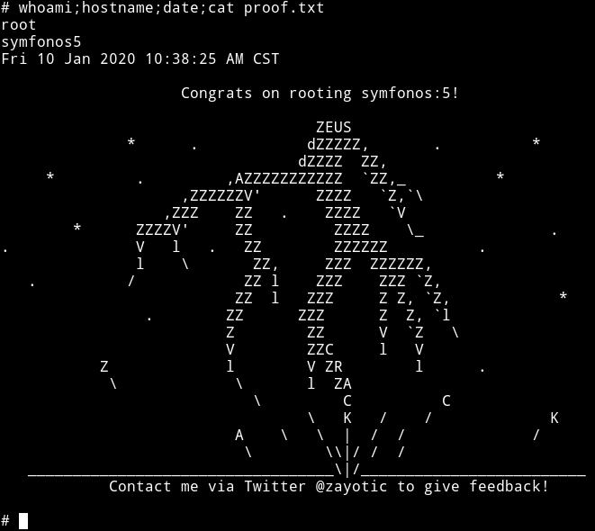

***

This is actually not so difficult machine but I really enjoyed it because I got to learn new stuff about LDAP.

Thanks to [@Zayotic](https://twitter.com/zayotic/) for this machine and this awesome series.

***

Thanks for reading, Feedback is always appreciated.

Follow me [@0xmzfr](https://twitter.com/0xmzfr) for more “Writeups”. And if you'd like to support me considering [donating](https://mzfr.github.io/donate/) 😄
