## Nmap

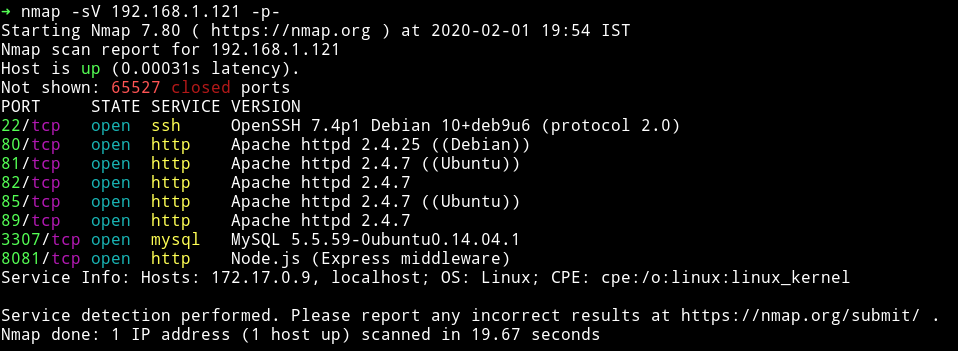

So there seems to be lot of services running. We'll start with port `80`.

***

## HTTP - port 80

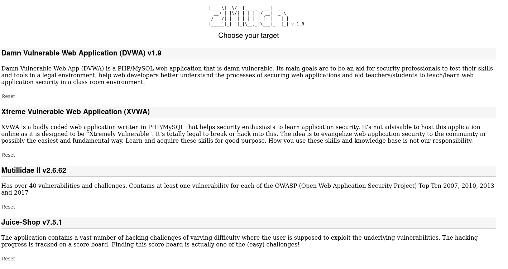

There seems to be having lot of other vulnerable machines in it. so now we know that most of those `http` services are just some other vulnerable machine/application but that won't give us access to the main machine.

So I started to look at the port `8081`. When we try to visit that we get `hello undefined`.

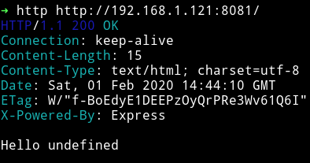

I spent sometime looking around the website but didn't found anything at all so I decided to fuzz using `ffuf`


```
http://192.168.1.121:8081/?name=ls
```

This gives a node error.

```bash
ReferenceError: sadas is not defined
    at eval (eval at <anonymous> (/home/4ndr34z/n-rce/app.js:5:23), <anonymous>:1:1)
    at /home/4ndr34z/n-rce/app.js:5:23
    at Layer.handle [as handle_request] (/home/4ndr34z/n-rce/node_modules/express/lib/router/layer.js:95:5)
    at next (/home/4ndr34z/n-rce/node_modules/express/lib/router/route.js:137:13)
    at Route.dispatch (/home/4ndr34z/n-rce/node_modules/express/lib/router/route.js:112:3)
    at Layer.handle [as handle_request] (/home/4ndr34z/n-rce/node_modules/express/lib/router/layer.js:95:5)
    at /home/4ndr34z/n-rce/node_modules/express/lib/router/index.js:281:22
    at Function.process_params (/home/4ndr34z/n-rce/node_modules/express/lib/router/index.js:335:12)
    at next (/home/4ndr34z/n-rce/node_modules/express/lib/router/index.js:275:10)
    at expressInit (/home/4ndr34z/n-rce/node_modules/express/lib/middleware/init.js:40:5)
```

But if we enter anything in qoutes it display that name. so if we do `?name='mzfr'` it will display `Hello mzfr`

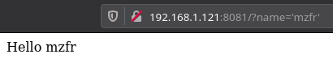


After searching for a while I found a [exploit for Node.js](https://kalilinuxtutorials.com/nodexp/).

I ran the exploit as

```bash
python2.7 nodexp.py --url="http://192.168.0.111:8081/?name=[INJECT_HERE]"
```

And then got a meterpreter shell and from there I got myself another reverse shell.

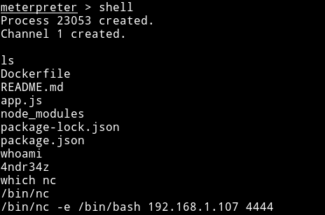

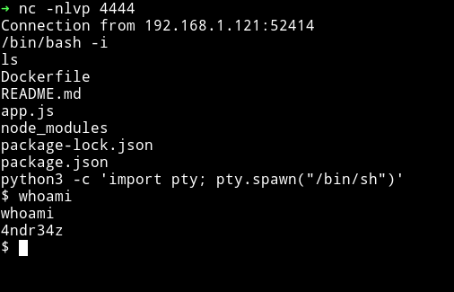

and in the `4ndr34z` home directory I found the `user.txt` file.

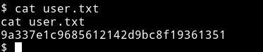

***

## Privilege Escalation

First I added my `public key` file in `/home/4ndr34z/.ssh` folder under `authorized_keys` file and then got a stable SSH connection.

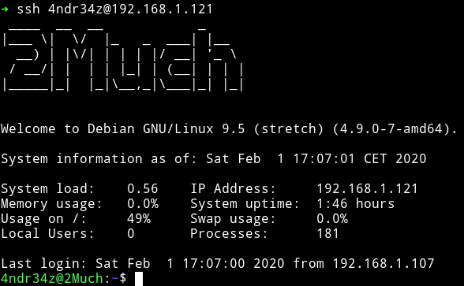

In that same directory I found a folder named `.mystuff` which had a file name `.cred` having password for `admin`.

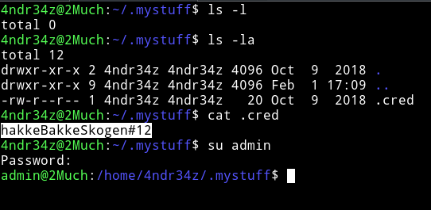

`admin:hakkeBakkeSkogen#12`

I spent sometime trying to find something but nothing worked. Then I noticed that `.bash_history` aren't linked to `/dev/null` so I read those and found something interesting in `4ndr34z` `.bash_history`

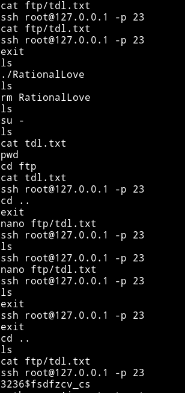

`root:3236$fsdfzcv_cs`

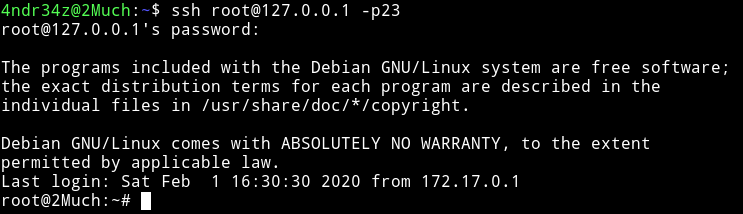

But now we are inside a `docker` and also I noticed a file named `tdl.txt`, the same file was in `/home/4ndr34z/ftp/` this could mean that it's sharing a folder with the machine. We can exploit this by SSH as root on the docker and leave an `SUID` in that folder and then come back on the machine and run that SUID to get the root shell.

```c
int main(void) {
       setgid(0); setuid(0);
       execl("/bin/sh","sh",0);
}
```
I compiled a binary having this C code. And then transfered that compiled binary using `wget` and then did `chmod 4755 root` to make it an SUID. All this has to be done from within the `docker` i.e after doing `ssh root@127.0.0.1 -p23`

__NOTE__: Even though `wget` is not installed we can just install it using `apt install wget` since we are `root` on the docker.

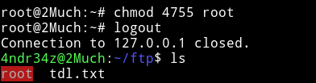

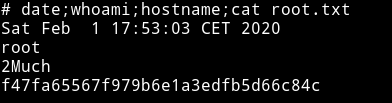

***

Thanks for reading, Feedback is always appreciated.

Follow me [@0xmzfr](https://twitter.com/0xmzfr) for more “Writeups”. And if you'd like to support me considering [donating](https://mzfr.github.io/donate/) 😄
